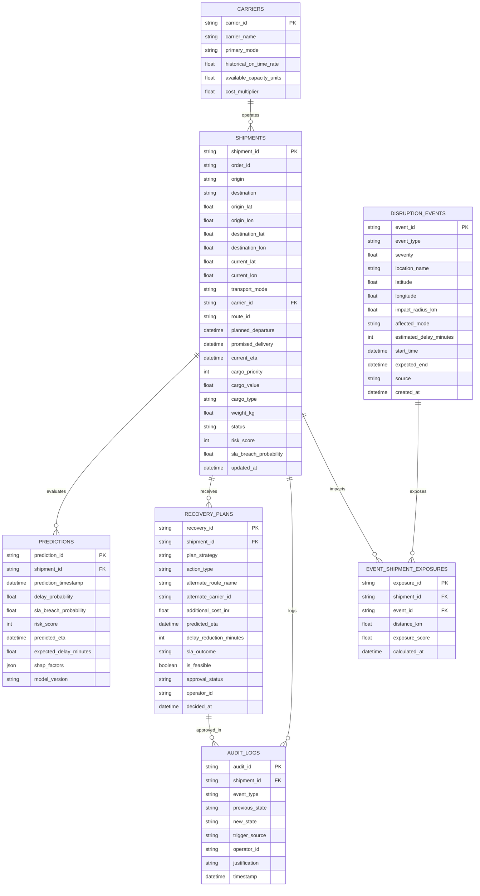

# Database Schema: YOLO × FluxQ

**Storage Engine:** SQLite (Local/Demo embedded) and PostgreSQL-compatible via SQLAlchemy ORM.  
**Timezone Standard:** Strict UTC (`TIMESTAMPTZ` / ISO 8601 strings).  
**Geospatial Standard:** WGS84 coordinates (`latitude`, `longitude` in decimal degrees).

---

## 1. Entity Relationship Diagram

---

## 2. Table Definitions (DDL Highlights)

### 2.1 `shipments`
- Primary key: `shipment_id VARCHAR(64) PRIMARY KEY`
- Key tracking fields: `origin`, `destination`, `origin_lat`, `origin_lon`, `destination_lat`, `destination_lon`, `current_lat`, `current_lon`, `route_id`, `transport_mode`, `carrier_id`
- Temporal deadlines: `planned_departure`, `promised_delivery`, `current_eta`
- Operational state: `status` (`in_transit`, `delayed`, `delivered`, `critical`, `rerouted`)
- Computed cache: `risk_score INTEGER`, `sla_breach_probability FLOAT`, `sla_buffer_minutes FLOAT`

### 2.2 `disruption_events`
- Primary key: `event_id VARCHAR(64) PRIMARY KEY`
- Categorization: `event_type VARCHAR(64)` (`TRAFFIC_CONGESTION`, `SEVERE_WEATHER`, `PORT_CONGESTION`, `FLIGHT_DELAY`, `HAZARD_EARTHQUAKE`, `ROAD_CLOSURE`)
- Metrics: `severity FLOAT` (0.0 to 10.0), `impact_radius_km FLOAT`, `estimated_delay_minutes INTEGER`
- Spatial & Temporal: `latitude FLOAT`, `longitude FLOAT`, `start_time TIMESTAMPTZ`, `expected_end TIMESTAMPTZ`

### 2.3 `recovery_plans`
- Primary key: `recovery_id VARCHAR(64) PRIMARY KEY`
- Reference: `shipment_id VARCHAR(64) REFERENCES shipments(shipment_id)`
- Strategic categorization: `plan_strategy` (`LOW_COST`, `MIN_DELAY`, `MAX_SLA`, `BALANCED`)
- Action assigned: `action_type` (`MAINTAIN_ROUTE`, `ALTERNATE_ROUTE`, `CARRIER_SWITCH`, `EXPEDITE`, `HOLD_MONITOR`, `ESCALATE`)
- Metrics: `additional_cost_inr FLOAT`, `predicted_eta TIMESTAMPTZ`, `is_feasible BOOLEAN`
- Lifecycle: `approval_status` (`PENDING`, `APPROVED`, `REJECTED`, `SUPERSEDED_REPLAN`)

### 2.4 `audit_logs`
- Primary key: `audit_id VARCHAR(64) PRIMARY KEY`
- Traceability: `shipment_id`, `event_type`, `previous_state JSON`, `new_state JSON`, `operator_id`, `justification`, `timestamp TIMESTAMPTZ`
