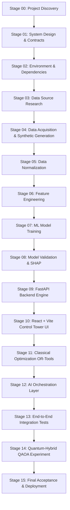

# Implementation Roadmap & Verification Milestones: YOLO × FluxQ
**Repository:** `https://github.com/kavinR-11/Flex-Q`  
**Current Status:** All 16 Stage-Gates Verified (`GATE_00` to `GATE_15`) & Audit Complete

---

## 1. Stage-Gated Milestone Progression

---

## 2. Stage Execution Summary

| Stage Gate | Focus Area | Key Deliverable | Verified Status |
|---|---|---|---|
| **GATE 00** | Project Discovery | [`GATE_00_PROJECT_DISCOVERY.md`](gates/GATE_00_PROJECT_DISCOVERY.md) | **PASS** |
| **GATE 01** | System Design | [`GATE_01_ARCHITECTURE.md`](gates/GATE_01_ARCHITECTURE.md) | **PASS** |
| **GATE 02** | Tools & Environment | [`GATE_02_TOOLS_AND_SKILLS.md`](gates/GATE_02_TOOLS_AND_SKILLS.md) | **PASS** |
| **GATE 03** | Data Source Research | [`GATE_03_DATA_SOURCE_RESEARCH.md`](gates/GATE_03_DATA_SOURCE_RESEARCH.md) | **PASS** |
| **GATE 04** | Data Acquisition | [`GATE_04_DATA_ACQUISITION.md`](gates/GATE_04_DATA_ACQUISITION.md) | **PASS** |
| **GATE 05** | Normalization | [`GATE_05_DATA_NORMALIZATION.md`](gates/GATE_05_DATA_NORMALIZATION.md) | **PASS** |
| **GATE 06** | Feature Engineering | [`GATE_06_FEATURE_ENGINEERING.md`](gates/GATE_06_FEATURE_ENGINEERING.md) | **PASS** |
| **GATE 07** | ML Model Training | [`GATE_07_ML_TRAINING.md`](gates/GATE_07_ML_TRAINING.md) | **PASS** |
| **GATE 08** | ML Validation | [`GATE_08_ML_VALIDATION.md`](gates/GATE_08_ML_VALIDATION.md) | **PASS** |
| **GATE 09** | Backend Development | [`GATE_09_BACKEND.md`](gates/GATE_09_BACKEND.md) | **PASS** |
| **GATE 10** | Frontend Delivery Hub | [`GATE_10_FRONTEND.md`](gates/GATE_10_FRONTEND.md) | **PASS** |
| **GATE 11** | Classical Optimization | [`GATE_11_CLASSICAL_OPTIMIZATION.md`](gates/GATE_11_CLASSICAL_OPTIMIZATION.md) | **PASS** |
| **GATE 12** | AI Orchestration | [`GATE_12_AI_ORCHESTRATION.md`](gates/GATE_12_AI_ORCHESTRATION.md) | **PASS** |
| **GATE 13** | End-to-End Integration | [`GATE_13_END_TO_END_INTEGRATION.md`](gates/GATE_13_END_TO_END_INTEGRATION.md) | **PASS** |
| **GATE 14** | Quantum-Hybrid QAOA | [`GATE_14_QUANTUM_EXPERIMENT.md`](gates/GATE_14_QUANTUM_EXPERIMENT.md) | **PASS** |
| **GATE 15** | Final Acceptance | [`GATE_15_FINAL_ACCEPTANCE.md`](gates/GATE_15_FINAL_ACCEPTANCE.md) | **PASS** |

---

## 3. Strict Audit Directive Alignment (Gates 0 to 11)

| Audit Gate | Scope & Deliverable | Status |
|---|---|---|
| **GATE 0** | Repository Acquisition & Inventory ([`docs/REPOSITORY_INVENTORY.md`](REPOSITORY_INVENTORY.md)) | **PASS** |
| **GATE 1** | Complete Feature Audit ([`docs/FEATURE_AUDIT_MATRIX.md`](FEATURE_AUDIT_MATRIX.md)) | **PASS** |
| **GATE 2** | Baseline Stability ([`docs/BASELINE_RUN_REPORT.md`](BASELINE_RUN_REPORT.md)) | **PASS** |
| **GATE 3** | Data Foundation & Schemas ([`docs/DATA_DICTIONARY.md`](DATA_DICTIONARY.md)) | **PASS** |
| **GATE 4** | ML Prediction & Calibration ([`docs/MODEL_CARD.md`](MODEL_CARD.md)) | **PASS** |
| **GATE 5** | Classical Optimization ([`docs/OPTIMIZATION_MODEL.md`](OPTIMIZATION_MODEL.md)) | **PASS** |
| **GATE 6** | Quantum-Hybrid QAOA ([`docs/QAOA_EXPERIMENT_REPORT.md`](QAOA_EXPERIMENT_REPORT.md)) | **PASS** |
| **GATE 7** | Disruption & Dynamic Replanning ([`docs/ORCHESTRATION_DESIGN.md`](ORCHESTRATION_DESIGN.md)) | **PASS** |
| **GATE 8** | Frontend Completeness ([`docs/FRONTEND.md`](FRONTEND.md)) | **PASS** |
| **GATE 9** | End-to-End Integration ([`docs/END_TO_END_TEST_REPORT.md`](END_TO_END_TEST_REPORT.md)) | **PASS** |
| **GATE 10** | Quality, Security & Deployment ([`docs/DEPENDENCY_AND_SECURITY_AUDIT.md`](DEPENDENCY_AND_SECURITY_AUDIT.md)) | **PASS** |
| **GATE 11** | Final Acceptance ([`docs/FINAL_ACCEPTANCE_REPORT.md`](FINAL_ACCEPTANCE_REPORT.md)) | **PASS** |
