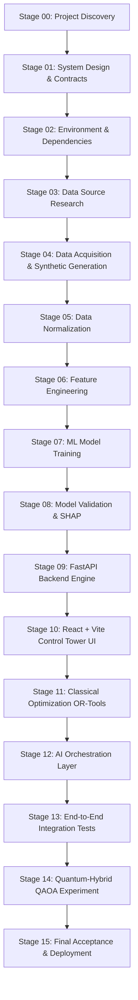

# Implementation Roadmap: YOLO × FluxQ

This roadmap outlines the sequential, stage-gated milestones for completing YOLO × FluxQ from discovery to final acceptance and deployment.

---

## Stage-Gated Milestones

### Stage Summary Table

| Stage | Focus Area | Key Deliverables | Status |
|---|---|---|---|
| **00** | Project Discovery | Document review, workspace inventory, roadmap | **CURRENT** |
| **01** | System Design | Architecture, API contracts, DB schema, event schema | Planned |
| **02** | Skills & Environment | Python venv, Node dependencies, tool verification | Planned |
| **03** | Data Source Research | Data source register, external provider analysis | Planned |
| **04** | Data Acquisition | Ingestion engine, synthetic generation, manifests | Planned |
| **05** | Normalization | Common schema converters, validation filters | Planned |
| **06** | Feature Engineering | Spatial/temporal joins, exposure calculation, zero-leakage splits | Planned |
| **07** | ML Training | Baselines, LightGBM/GBR classifiers & regressors, calibration | Planned |
| **08** | ML Validation | PR-AUC, ROC-AUC, Brier score, MAE, SHAP explanations | Planned |
| **09** | Backend Development | FastAPI application, database, REST endpoints, services | Planned |
| **10** | Frontend Delivery Hub | React + TypeScript + Tailwind + Leaflet + Recharts dashboard | Planned |
| **11** | Classical Optimization | Google OR-Tools multi-objective MIP solver, candidate plans | Planned |
| **12** | AI Orchestration | Closed-loop triage, EWI engine, replanning coordinator | Planned |
| **13** | End-to-End Integration | Multi-scenario simulation, replanning validation, audit tests | Planned |
| **14** | Quantum-Hybrid | QUBO residual formulation, Qiskit QAOA simulation, QCR metric | Planned |
| **15** | Final Acceptance | Docker setup, demo guide, comprehensive technical documentation | Planned |
