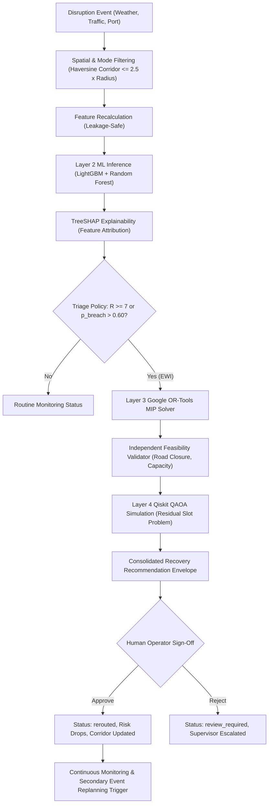

# YOLO × FluxQ: AI Orchestration Layer Design & Operational Specification

## 1. Architectural Mission & Principles

The **AI Orchestration Layer** (`backend/app/orchestration/orchestrator.py`) is the central operational nervous system of **YOLO × FluxQ**. It coordinates the asynchronous flow of external sensory telematics, machine learning risk predictions, classical combinatorial optimization, quantum-hybrid experimentation, and human-in-the-loop governance.

### Core Architectural Principles:
1. **Deterministic Safety Contracts:** No autonomous decision with real-world physical implications (e.g. rerouting freight, carrier reassignment, contract SLA alteration) is executed without human operator authorization.
2. **Layered Separation of Concerns:**
   - **Layer 1 (Data Intelligence):** Telematics ingestion, geographic corridor projection, and temporal alignment.
   - **Layer 2 (AI/ML Prediction):** Leakage-free ML risk inference, calibrated SLA breach probabilities, dynamic ETA calculation, and TreeSHAP attribution.
   - **Layer 3 (Classical Triage & Optimization):** Feasibility-checked MIP multi-objective rerouting via Google OR-Tools.
   - **Layer 4 (Quantum-Hybrid Optimization):** Experimental QAOA QUBO allocation simulation with Quantum Contribution Ratio (QCR) benchmarking.
3. **Immutable Audit Trail:** Every event observation, inference score change, solver output, operator action (Approval/Rejection), and dynamic replanning trigger is permanently recorded in SQLite/PostgreSQL with timestamps, state snapshots, and justifications.

---

## 2. End-to-End Decision Flow

---

## 3. Operational State Transitions

| Starting State | Trigger / Event | Action Taken | Destination State | Audit Log Event |
|---|---|---|---|---|
| `in_transit` | Routine Telematics | ML Scoring ($R \le 6$) | `in_transit` | `PERIODIC_RECOMPUTE` |
| `in_transit` | Corridor Disruption | EWI Triggered ($R \ge 7, p > 0.60$) | `critical` | `CORRIDOR_DISRUPTION_IMPACT` |
| `critical` | EWI Active | OR-Tools MIP Optimization | `critical` (Pending Plans) | `RECOVERY_PLAN_GENERATED` |
| `critical` | Dispatcher Approval | Route / Carrier Updated, ETA reset | `rerouted` ($R \le 3$) | `OPERATOR_RECOVERY_APPROVED` |
| `critical` | Dispatcher Rejection | Escalation to Operations Lead | `review_required` | `OPERATOR_RECOVERY_REJECTED` |
| `rerouted` | Secondary Disruption | Recovery Route Invalidated | `critical` (Auto Re-plan) | `REPLANNING_TRIGGERED` |

---

## 4. Deterministic Contracts & API Schema

### Disruption Ingestion Request Schema
- `event_id`: Unique identifier (string).
- `event_type`: Categorical string (`"SEVERE_WEATHER"`, `"TRAFFIC_CONGESTION"`, `"ROAD_CLOSURE"`, etc.).
- `severity`: Normalized float scale $[1.0, 5.0]$.
- `latitude`, `longitude`: Decimal coordinates.
- `impact_radius_km`: Float radius of disruption envelope.
- `affected_mode`: `"ROAD"`, `"AIR"`, `"RAIL"`, `"MARITIME"`, or `"ALL"`.
- `estimated_delay_minutes`: Integer projected baseline delay.

### Recovery Recommendation Envelope
- `shipment_id`: Target shipment.
- `status`: `"OPTIMIZED_AWAITING_APPROVAL"`.
- `candidate_plans_count`: Integer count of evaluated strategies.
- `recommended_plan_id`: Primary OR-Tools balanced strategy identifier.
- `recommended_plan`: Structured option details (Route, Carrier, Cost INR, ETA, Feasibility).
- `quantum_hybrid_benchmark`: Qiskit QAOA simulation metrics (QCR %, runtime ms, qubit count).

---

## 5. Failure Modes and Fallback Resilience

1. **Model Ingestion Failure:** If external features are missing or corrupted, the orchestrator falls back to the calibrated baseline model or heuristic SLA buffer projections without halting the system.
2. **MIP Infeasibility:** If extreme disruptions block all primary and secondary routes, the optimizer returns an `ESCALATE_HOLD` action with emergency holding instructions for the nearest logistics terminal.
3. **Quantum Simulator Timeout:** The Qiskit QAOA simulation runs asynchronously as a background research task; classical OR-Tools solutions are guaranteed and immediate.
