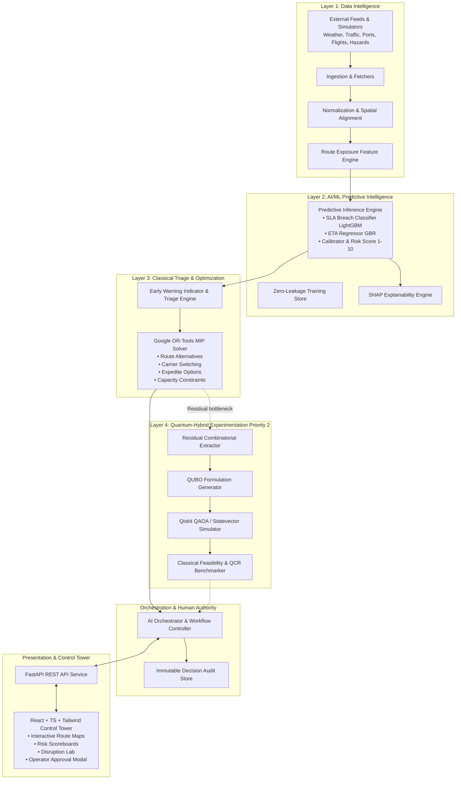

# System Architecture: YOLO × FluxQ

**Platform Identity:** YOLO × FluxQ  
**Problem Statement:** Theme 4 — Logistics and Supply Chain, PS 1 — Shipment Delivery Risk Score  
**Architecture Model:** 4-Tier Operational Pipeline with Modular Subservices and Closed-Loop Orchestration.

---

## 1. High-Level Architecture Overview

YOLO × FluxQ is designed as an autonomous, closed-loop predictive risk intelligence and recovery platform following the operational loop:

$$\textbf{Sense} \longrightarrow \textbf{Normalize} \longrightarrow \textbf{Predict} \longrightarrow \textbf{Explain} \longrightarrow \textbf{Triage} \longrightarrow \textbf{Optimize} \longrightarrow \textbf{Recommend} \longrightarrow \textbf{Approve} \longrightarrow \textbf{Replan}$$

---

## 2. Detailed Layer Specifications

### 2.1 Layer 1: Data Intelligence
- **Data Ingestion Modules:**
  - `weather_fetcher`: Ingests weather conditions (precipitation, wind speed, visibility, storms).
  - `traffic_fetcher`: Ingests road speeds, congestion index, lane closures, and accident incidents.
  - `port_fetcher`: Ingests port call delays, dwell times, and berth congestion.
  - `aviation_fetcher`: Ingests flight delays, cancellations, and airport congestion.
  - `hazard_fetcher`: Ingests earthquakes (USGS), flooding, and infrastructure hazards.
  - `shipment_loader`: Manages shipment tracking events, GPS progress, and milestone updates.
- **Normalization Service:** Converts all incoming telemetry into unified units (km/h, mm, minutes, UTC timestamps, GeoJSON coordinates).
- **Route-Exposure Engine:** Intersects shipment route corridors against spatial-temporal bounding circles of disruption events to calculate dynamic exposure scores:
  $$\text{exposure\_score} = \sum_k \frac{\text{severity}_k}{\max(1, \text{distance\_km}_k)} \cdot \mathbb{I}(\text{mode matches})$$

### 2.2 Layer 2: AI/ML Predictive Intelligence
- **Task A & B: Calibrated Probability:**
  - LightGBM / Gradient Boosting classifier trained on historical route exposure.
  - Outputs calibrated probability $p = P(\text{SLA breach} \mid X) \in [0, 1]$.
  - Calculates the official integer risk score:
    $$R = \max(1, \min(10, \lceil 10 \cdot p \rceil))$$
- **Task C: ETA Regression:**
  - Gradient Boosting Regressor predicting updated transit time and $\widehat{\text{ETA}}$.
  - Expected delay: $\widehat{D} = \max(0, \widehat{\text{ETA}} - \text{ETA}_{\text{promised}})$.
- **Explainability (SHAP):**
  - Evaluates local TreeSHAP values for the top influential risk features (e.g. `remaining_sla_buffer`, `traffic_delay_minutes`, `weather_severity`, `carrier_reliability`).

### 2.3 Layer 3: Classical Recovery Optimization (Google OR-Tools)
- **Primary Operational Engine:**
  - Formulates a Mixed Integer Programming (MIP) problem using OR-Tools `pywraplp`.
  - Computes candidate recovery plans across discrete recovery actions $a \in \{\text{MAINTAIN\_ROUTE}, \text{ALTERNATE\_ROUTE}, \text{CARRIER\_SWITCH}, \text{EXPEDITE}, \text{HOLD\_MONITOR}, \text{ESCALATE}\}$.
  - Enforces carrier capacity limits $\sum_i q_i x_{i,a} \le \text{Cap}_a$, road closure feasibility, budget bounds, and delivery deadlines.
  - Evaluates multi-criteria trade-offs:
    $$\min \sum_i \sum_a x_{i,a} (\alpha C_{i,a} + \beta D_{i,a} + \gamma B_{i,a} + \delta E_{i,a})$$
  - Generates 4 distinct ranked strategic recovery plans:
    1. **Plan A:** Minimum Cost
    2. **Plan B:** Minimum Delay
    3. **Plan C:** Maximum SLA Reliability
    4. **Plan D:** Balanced Operational Compromise

### 2.4 Layer 4: Quantum-Hybrid Experimentation (Priority 2)
- **Residual Combinatorial Problem:**
  - When multiple high-priority shipments compete for a strictly limited subset of premium alternative carrier capacity, the residual assignment problem is extracted:
    $$\min x^T Q x$$
- **Qiskit QAOA / Statevector Simulator:**
  - Constructs Ising Hamiltonian and runs QAOA circuit simulation with $p$-depth parameterization.
  - Decodes measurement samples into binary assignment vectors.
  - Passes candidates to an independent classical feasibility checker.
  - Computes Quantum Contribution Ratio:
    $$\text{QCR} = \frac{J_{\text{classical}} - J_{\text{hybrid}}}{J_{\text{classical}}} \times 100\%$$
- **Reliability Isolation:** If Qiskit is slow, unavailable, or encounters infeasible quantum samples, the system defaults unconditionally to the OR-Tools classical solution with zero impact on user operations.

### 2.5 Layer 5: AI Orchestration & Replanning
- Coordinates the reactive loop upon receiving new events.
- **Dynamic Replanning:**
  1. Compares newly predicted risk with existing plan.
  2. If an approved route is compromised by a new disruption, marks existing plan `INVALIDATED`.
  3. Re-runs optimization only for affected shipments, preserving unaffected shipments to minimize operational churn.
  4. Requires explicit operator approval before executing any new plan.

---

## 3. Technology Stack Mapping

| Layer / Component | Technology | Rationale |
|---|---|---|
| **Frontend UI** | React 18, TypeScript, Vite, Tailwind CSS | High performance, responsive, type-safe control tower |
| **Interactive Maps** | Leaflet + OpenStreetMap | Precise route geometry and disruption marker rendering |
| **Telemetry & Visuals** | Recharts, Lucide React | Clean, responsive charting of risk trends and Pareto frontiers |
| **Backend API** | Python 3.12, FastAPI, Pydantic v2 | Asynchronous high-throughput REST API with strict schemas |
| **Database** | SQLite (Local/Demo) & PostgreSQL-compatible SQLAlchemy | Zero-configuration local execution with enterprise readiness |
| **ML Engine** | Scikit-learn, LightGBM, SHAP, Joblib | State-of-the-art tabular gradient boosting and explainability |
| **Optimization Solver** | Google OR-Tools (CBC/SCIP MIP) | Industrial-strength deterministic combinatorial solver |
| **Quantum Simulation** | Qiskit, Qiskit Aer / Statevector | Standard quantum algorithmic research and QUBO simulation |
| **Testing** | Pytest, HTTPX, Vitest | Comprehensive unit, integration, and end-to-end testing |
| **Containerization** | Docker, Docker Compose | Reproducible multi-service deployment |
